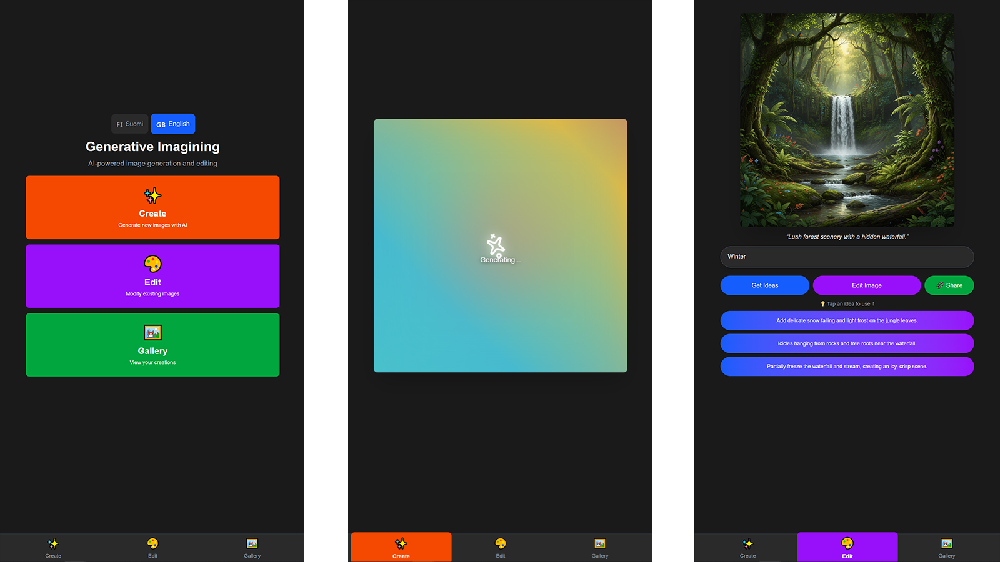
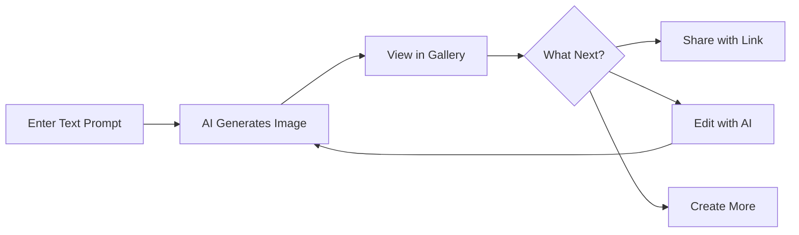

# Generative Imagining ✨

An AI-powered platform that turns imagination into images. Users can create and edit images using natural language, designed for educational environments with built-in content moderation.


_Create stunning images with simple text descriptions_

## What is Generative Imagining?

Generative Imagining is a safe, accessible platform for creating AI-generated images. Simply describe what you want to see, and watch the AI bring your ideas to life. Perfect for creative exploration, educational projects, and learning about AI image generation.

### ✨ Key Features

- 🎨 **Text-to-Image Creation** - Describe your vision in plain language
- ✏️ **AI-Powered Editing** - Modify existing images with natural instructions
- 🖼️ **Personal Gallery** - Organize and manage your creations
- 🔗 **Easy Sharing** - Share images with a single link
- 🌍 **Bilingual Support** - Available in English and Finnish
- 🛡️ **Content Moderation** - Built-in safety for educational settings
- 🎭 **No Account Required** - Start creating immediately

## How It Works



1. **Enter a Prompt** - Describe the image you want to create
2. **AI Generation** - Powered by Google Gemini 2.5 Flash
3. **View & Manage** - Browse your gallery, share, or edit
4. **Keep Creating** - Unlimited creative possibilities

## Quick Start

### Using Docker (Recommended)

```bash
# Clone the repository
git clone https://github.com/yourusername/generative-imagining.git
cd generative-imagining

# Set up environment variables
cp .env.example .env
# Edit .env and add your Google API key

# Start the application
docker-compose up -d

# Access the application
# Frontend: http://localhost:3000
# Backend: http://localhost:8000
```

### Manual Setup

**Prerequisites:**

- Python 3.9+
- Node.js 18+
- MongoDB
- Google Gemini API key

**Backend:**

```bash
cd backend
pip install -r requirements.txt
python main.py
```

**Frontend:**

```bash
cd frontend
npm install
npm run dev
```

See [SETUP.md](SETUP.md) for detailed installation instructions.

## Configuration

Create a `.env` file in the root directory:

```env
# Google Gemini API
GOOGLE_API_KEY=your_api_key_here

# MongoDB
MONGO_URI=mongodb://localhost:27017

# Admin Access
ADMIN_PASSWORD=your_secure_password
```

## For Educators & Administrators

Generative Imagining is designed for educational environments:

- **Password Management** - Create time-limited access codes for students
- **Usage Limits** - Control how many images each password can generate
- **Content Moderation** - AI-powered filtering with customizable guidelines
- **Activity Monitoring** - View usage statistics and moderate content
- **Safe Environment** - No personal data collection, anonymous usage

Access the admin panel at `/admin` with your configured password.

## Technology Stack

- **AI**: Google Gemini 2.5 Flash
- **Backend**: Python FastAPI + MongoDB
- **Frontend**: Next.js + React + TypeScript
- **Deployment**: Docker & Docker Compose

For technical details, see [TECHNICAL.md](TECHNICAL.md).

## Use Cases

- 🎓 **Education** - Creative writing prompts, visual learning aids
- 🎨 **Art Exploration** - Discover AI art generation techniques
- 📚 **Storytelling** - Visualize characters and scenes
- 🧪 **Experimentation** - Learn about AI capabilities and limitations
- 🎮 **Game Design** - Prototype characters and environments

## Project Status

This is an actively developed MVP. See [GitHub Issues](../../issues) for planned features and known limitations.

## Contributing

Contributions are welcome! Please read [CONTRIBUTING.md](CONTRIBUTING.md) for guidelines.

## License

MIT License - see [LICENSE](LICENSE) file for details.

## Support & Documentation

- 📖 [Setup Guide](SETUP.md) - Detailed installation instructions
- 🔧 [Technical Documentation](TECHNICAL.md) - Architecture and API details
- 💬 [GitHub Discussions](../../discussions) - Ask questions and share ideas
- 🐛 [Issue Tracker](../../issues) - Report bugs or request features

---

**Made with ❤️ for creative minds and curious learners**
